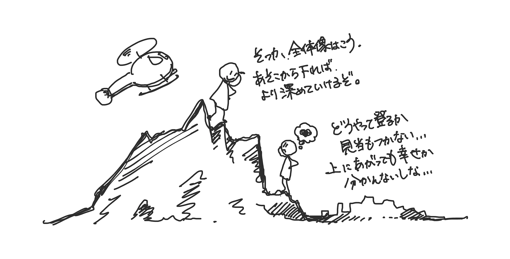

# 秒速DEEP LEARNING

---

# 機械学習・深層学習を学ぶための地図を持とう

---

---

## 「知る・わかる」から「できる」へのロードマップ

---

### 機械学習・深層学習を学ぶみちすじ

---

### 「Why/What/How」 - 地図3: 適用分野と手法

---

#### ビジネス適用の事例

- :pencil: McKinseyのAI事例・考察レポート [Notes from the AI frontier: Applications and value of deep learning](https://www.mckinsey.com/featured-insights/artificial-intelligence/notes-from-the-ai-frontier-applications-and-value-of-deep-learning) 

---

#### アート適用の事例

- [NIPS 2017 Art Gallery | Machine Learning for Creativity and Design](https://nips2017creativity.github.io/)
- [Art Gallery – NIPS Machine Learning for Creativity and Design](http://nips4creativity.com/)
- [Machine Learning for Artists](http://ml4a.github.io/ml4a/)
!: [Learning to see: Gloomy Sunday](https://vimeo.com/260612034)

---

### 「必要な道具と実装」 - 地図6: システム、アーキテクチャと権利

- :bar_chart: AIをビジネスで扱う際知っておくべきこと [弁護士 柿沼太一氏『AI開発を円滑に進めるための契約・法務・知財』](
https://www.slideshare.net/hironojumpei/ai-129527593)

---

## さまざまな分野と最先端の事例

---

### 各分野の広がりと最新状況を知る

- 膨大な数の実装付き論文のまとめサイト [Browse the State-of-the-Art in Machine Learning](https://paperswithcode.com/sota)

---

### 数値・表形式 - 推論: データから、対象を予測する

---

表（テーブル）形式のデータを対象とした機械学習の概要、現状紹介。

- Airbnb事例 [【KDD2018】論文『Customized Regression Model for Airbnb Dynamic Pricing』を読んでまとめた - 港区で苦しむデータサイエンティストのメモ帳](https://honawork.hatenablog.com/entry/2018/08/24/181947)
- コンペ参加と、過去事例から「何ができるか」学ぶことのすすめ
    - [Kaggle: Your Home for Data Science](https://www.kaggle.com/)
    - [SIGNATE - Data Science Competition](https://signate.jp/)
    - [Kaggle Past Competitions](https://ndres.me/kaggle-past-solutions/)

---

### 画像／映像系 - 認識: AIの目にうつるもの

---

一般物体認識・特定物体認識の概要、現状紹介。

---

- ImageNet画像認識コンペでの深層学習の躍進 [ImageNet Large Scale Visual Recognition Competition 2012 (ILSVRC2012)](http://www.image-net.org/challenges/LSVRC/2012/results.html)

---

- ! [YOLOv2 vs YOLOv3 vs Mask RCNN vs Deeplab Xception - YouTube](https://www.youtube.com/embed/s8Ui_kV9dhw)

---

- 骨格検出を使った楽しいデモ [AI Experiments: Move Mirror](https://experiments.withgoogle.com/collection/ai/move-mirror/view)

---

- 骨格検出 :pencil: :movie_camera: [DensePose](http://densepose.org/)

---

- 特定物体認識 [Google Landmark Recognition Challenge | Kaggle](https://www.kaggle.com/c/landmark-recognition-challenge/)

---

### 画像／映像系 - 生成: AIの描き出すもの

---

---

---

---

---

- :pencil:  [BigGAN: A New State of the Art in Image Synthesis – SyncedReview – Medium](https://medium.com/syncedreview/biggan-a-new-state-of-the-art-in-image-synthesis-cf2ec5694024)
- :pencil: [シモセラ エドガー　敵対的データ拡張による自動線画化](https://esslab.jp/~ess/ja/research/sketch_master/)
- [PaintsChainer -線画自動着色サービス-](https://paintschainer.preferred.tech/index_ja.html)

---

---

- :newspaper: [“少ないデータ”で高精度AIを実現したRidge-i--白黒映像をカラーに、ゴミ焼却炉は自動化 - CNET Japan](https://japan.cnet.com/article/35121159/)

---

---

---

### 画像／映像系 - 認識と生成の間

---

深層生成モデルの持つ可能性、リスク、解釈性について。こちらも前半のビデオが興味深いです。後半に解釈性の説明があります。

---

@css[title-top-right](CycleGAN Face-off 直播換臉)

---

- :newspaper: [Here Come the Fake Videos, Too - The New York Times](https://www.nytimes.com/2018/03/04/technology/fake-videos-deepfakes.html)

---

@css[title-top-right](FaceForensics)

---

@css[title-top-right](FaceForensics)

---

- [NIPS 2017 Competition Track](https://nips.cc/Conferences/2017/CompetitionTrack)
- [NIPS 2018 Competition Track](https://nips.cc/Conferences/2018/CompetitionTrack)
- [NIPS’17 Adversarial Learning Competition に参戦しました | Preferred Research](https://research.preferred.jp/2018/04/nips17-adversarial-learning-competition/)
- [Activation Atlas](https://distill.pub/2019/activation-atlas/)
- :octocat: [tensorflow/lucid: A collection of infrastructure and tools for research in neural network interpretability.](https://github.com/tensorflow/lucid)

---

### 文章／言語系 - 言葉を操るAI

---

代表的な対話ボットから、文章生成のデモまでを取り上げます。

---

- [Google Translate](https://translate.google.co.jp/)
- [りんな](https://www.rinna.jp/)
- [Studio OusiaのAIがクイズチャンピオン達と対戦し勝利 | Studio Ousia](http://www.ousia.jp/ja/page/ja/2017/12/14/nips/)
- [コンピュータが小説を書く日](http://kotoba.nuee.nagoya-u.ac.jp/sc/gw2015/)
- :pencil: [1901.11504 Multi-Task Deep Neural Networks for Natural Language Understanding](https://arxiv.org/abs/1901.11504)
- [Better Language Models
and Their Implications](https://openai.com/blog/better-language-models/)

---

### 音声／音楽系 -  AIが聴き・話し・演奏するもの

---

スマートスピーカに代表される音声認識・合成から、音楽の生成まで事例を取り上げます。

---

- :newspaper: [Googleアシスタントが音声通話で予約を取ってくれる――マンハッタンのレストランでDuplexのデモに参加してきた | TechCrunch Japan](https://jp.techcrunch.com/2018/06/28/2018-06-27-a-closer-look-at-google-duplex/)
- :pencil: [A Neural Parametric Singing Synthesizer](https://mtg.github.io/singing-synthesis-demos/)

---

@css[title-top-right](A Universal Music Translation Network)

---

- [Magenta](https://magenta.tensorflow.org/)
- [AI Experiments | Experiments with Google](https://experiments.withgoogle.com/collection/ai)
- [ISMIR 2018](http://ismir2018.ircam.fr/)

---

---

- :octocat: [ybayle/awesome-deep-learning-music: List of articles related to deep learning applied to music](https://github.com/ybayle/awesome-deep-learning-music)
- :pencil: :movie_camera: [The Sound of Pixels](http://sound-of-pixels.csail.mit.edu/)
- :pencil: :movie_camera: [Gierad Laput | Synthetic Sensors](http://www.gierad.com/projects/supersensor/)

---

### グラフを扱う

---

数理的にグラフとして構造が表されるものはたくさんあります。グラフを扱った深層学習の現状について。

---

- :pencil: [機は熟した！グラフ構造に対するDeep Learning、Graph Convolutionのご紹介 - ABEJA Arts Blog](https://tech-blog.abeja.asia/entry/2017/04/27/105613)
- :pencil: [Graph Convolutionを自然言語処理に応用する Part1 – programming-soda – Medium](https://medium.com/programming-soda/graph-convolution%E3%82%92%E8%87%AA%E7%84%B6%E8%A8%80%E8%AA%9E%E5%87%A6%E7%90%86%E3%81%AB%E5%BF%9C%E7%94%A8%E3%81%99%E3%82%8B-part1-b792d53c4c18)
- :pencil: [1812.08434 Graph Neural Networks: A Review of Methods and Applications](https://arxiv.org/abs/1812.08434)
- :pencil: [1901.00596 A Comprehensive Survey on Graph Neural Networks](https://arxiv.org/abs/1901.00596)

---

### その他の領域

---

ここまでの紹介に入らない、触覚、3次元モデルなどの深層学習事例について。

---

- :newspaper: [東大と日立の研究者、素材に触れた時の触振動を画像からそれっぽく生成し、効率的な触感デザインを可能とする手法「TactGAN」を発表 | Seamless](https://shiropen.com/seamless/tactgan)
- :octocat: [timzhang642/3D-Machine-Learning: A resource repository for 3D machine learning](https://github.com/timzhang642/3D-Machine-Learning)

---

---

### 強化学習: 行動を学ぶAI

---

Atariゲーム、碁、最近では多人数プレイのリアルタイム戦略ゲームまで、強化学習の幅が広がりました。その事例について。

---

- :pencil: [Recurrent Experience Replay in Distributed Reinforcement Learning | OpenReview](https://openreview.net/forum?id=r1lyTjAqYX)
- :pencil: [Google AI Blog: How Robots Can Acquire New Skills from Their Shared Experience](https://ai.googleblog.com/2016/10/how-robots-can-acquire-new-skills-from.html)
- :bar_chart: [https://outreach.didichuxing.com/tutorial/AAAI2019/static/DRL with Applications in Transp_AAAI19tutorial.pdf](https://outreach.didichuxing.com/tutorial/AAAI2019/static/DRL%20with%20Applications%20in%20Transp_AAAI19tutorial.pdf)
- :newspaper: [横河電機とNAISTが化学プラント向けに強化学習、少ない試行回数で高度な制御を実現 | 日経 xTECH（クロステック）](https://tech.nikkeibp.co.jp/atcl/nxt/mag/rob/18/012600001/00018/)

---

# さまざまな事例を実践してみよう

こちらにはリンクを紹介します。メインはノートブックで26事例を実行し、触れてみることです。ノートブックは、サポートページ [https://github.com/tomo-makes/dl-in-a-sec](https://github.com/tomo-makes/dl-in-a-sec) から試せます。

---

## 数値・表形式のデータを使った機械学習を試す

**東大松尾研データサイエンス講座に取り組む**

- [グローバル消費インテリジェンス寄附講座演習コンテンツ 公開ページ | 東京大学松尾研究室 - Matsuo Lab](https://weblab.t.u-tokyo.ac.jp/gci_contents/)
- :books: [東京大学のデータサイエンティスト育成講座 ~Pythonで手を動かして学ぶデ―タ分析~](https://amzn.to/2H5w8xB) - 上記の書籍化版

**まとめと発展**

- [Kaggler Slack作りました - tkm2261's blog](http://yutori-datascience.hatenablog.com/entry/2017/08/23/143146)
- [Kaggleに登録したら次にやること ～ これだけやれば十分闘える！Titanicの先へ行く入門 10 Kernel ～ - Qiita](https://qiita.com/upura/items/3c10ff6fed4e7c3d70f0)
- [【随時更新】Kaggleテーブルデータコンペできっと役立つTipsまとめ - 麻か辣なら辣が好き](https://naotaka1128.hatenadiary.jp/entry/kaggle-compe-tips)

---

## 画像／映像を扱う深層学習を試す

**概要**

- :bookmark: [Intuitively Understanding Convolutions for Deep Learning](https://towardsdatascience.com/intuitively-understanding-convolutions-for-deep-learning-1f6f42faee1)
- :bookmark: [TensorSpace Playground](https://tensorspace.org/html/playground/index.html)

---

**まとめと発展**

- :pencil: [サーベイ論文 畳み込みニューラルネットワークの研究動向](http://mprg.jp/data/MPRG/F_group/F188_uchida2017.pdf)
- :pencil: [はじめてのGAN](https://elix-tech.github.io/ja/2017/02/06/gan.html)
- :bar_chart: [3D CNNによる人物行動認識の動向](https://www.slideshare.net/kenshohara11/3d-cnn)
- :bar_chart: [Action Recognitionの歴史と最新動向](https://www.slideshare.net/OhnishiKatsunori/action-recognition)
- :pencil: [変わりゆく機械学習と変わらない機械学習](https://www.jps.or.jp/books/gakkaishi/2019/01/74-01seriesAIphys2.pdf)
- :bar_chart: [CVPR 2018 完全読破チャレンジ](http://hirokatsukataoka.net/project/cc/cvpr2018survey.html)

---

## 自然言語を扱う深層学習を試す

**概要**

- [Illustrated Guide to Recurrent Neural Networks – Towards Data Science](https://towardsdatascience.com/illustrated-guide-to-recurrent-neural-networks-79e5eb8049c9)

---

**まとめと発展**

- :bar_chart: [最新版  JSAI2018 チュートリアル「"深層学習時代の" ゼロから始める自然言語処理」](https://www.slideshare.net/yukiarase/jsai2018-101054060)
- :books: [ゼロから作るDeep Learning ❷ ―自然言語処理編](https://amzn.to/2UYJOzv)
- [BERT with SentencePiece を日本語 Wikipedia で学習してモデルを公開しました – 原理的には可能 – データ分析界隈の人のブログ、もとい雑記帳](https://yoheikikuta.github.io/bert-japanese/)
- [Jay Alammar – Visualizing machine learning one concept at a time](https://jalammar.github.io/)

---

## 音を扱う深層学習を試す

**概要**

- [nnmnkwii 0.0.18+3162967 documentation](https://r9y9.github.io/nnmnkwii/latest/)

---

**まとめと発展**

- :pencil: [2018/8/18 Design with .AI - AIとつくり、AIと学ぶ - vol.1 ”AIと音響/音楽のいま”  セミナー資料](http://bit.ly/aiandsound)
- :pencil: [Deep Learningを用いた音楽生成手法のまとめ サーベイ – Nao Tokui (Qosmo) – Medium](https://medium.com/@naotokui/deep-learning%E3%82%92%E7%94%A8%E3%81%84%E3%81%9F%E9%9F%B3%E6%A5%BD%E7%94%9F%E6%88%90%E6%89%8B%E6%B3%95%E3%81%AE%E3%81%BE%E3%81%A8%E3%82%81-%E3%82%B5%E3%83%BC%E3%83%99%E3%82%A4-1298d29f8101)
- :pencil: [日本音響学会誌](https://www.jstage.jst.go.jp/browse/jasj/-char/ja)
	- :pencil: [日本音響学会誌 74巻9号](https://www.jstage.jst.go.jp/browse/jasj/74/9/_contents/-char/ja)
		- 音声翻訳システムの実用化と課題
		- 音声翻訳システムにおける音声変換の利用 など
	- :pencil: [日本音響学会誌 74巻7号](https://www.jstage.jst.go.jp/browse/jasj/74/7/_contents/-char/ja)
		- 音声認識技術の変遷と最先端
		- テキスト音声合成技術の変遷と最先端
		- 音響信号処理の変遷と最先端 など

---

## 強化学習系を試す

**概要**

- [OpenAI Gym](https://gym.openai.com/docs/)
- :octocat: [openai/baselines: OpenAI Baselines: high-quality implementations of reinforcement learning algorithms](https://github.com/openai/baselines)
- :octocat: [Welcome to Stable Baselines docs! - RL Baselines Made Easy — Stable Baselines 2.5.1 documentation](https://stable-baselines.readthedocs.io/en/master/)
- :octocat: [araffin/rl-baselines-zoo: A collection of 80+ pre-trained RL agents using Stable Baselines](https://github.com/araffin/rl-baselines-zoo)

**まとめと発展**

- :bar_chart: [多様な強化学習の概念と課題認識](https://www.slideshare.net/yukono1/ss-102843951)
- :books: [機械学習スタートアップシリーズ Pythonで学ぶ強化学習 入門から実践まで (KS情報科学専門書)](https://amzn.to/2VIhlm7)

---

## 深層学習を使ったアプリのPrototyping

**JavaScriptのMLライブラリ**

- [p5.js | home](https://p5js.org/)
- [ml5js · Friendly Machine Learning For The Web.](https://ml5js.org/)
- [Magenta.js](https://magenta.tensorflow.org/js-announce)
- [TensorFlow.js  |  TensorFlow](https://www.tensorflow.org/js)

**プロトタイプの開発環境**

- [p5.js Web Editor](https://editor.p5js.org/)

**いろいろな作例を動かしてみる**

- :octocat: [ml5js/ml5-examples: A collection of ml5.js examples](https://github.com/ml5js/ml5-examples/)

**既存のアプリ作例を見る**

- [Pose Net](https://editor.p5js.org/ ml5/sketches/B1uDXDugX) - リンク切れ

**まとめと発展**

- :octocat: [yining1023/machine-learning-for-the-web: Repository for the "Machine Learning for the Web" class at ITP, NYU](https://github.com/yining1023/machine-learning-for-the-web)
- [Machine Learning for Artists](http://ml4a.github.io/)

---

## 最新の知見についていくために

---

自分の追いたい抽象度を意識しながら、上のトレンドに終わらせず、継続して最新情報を追いかけてみます。その際のリソース・考え方紹介です。

---

---

### 新しい情報を取り入れるには

- [The illustrated guide to a Ph.D.](http://matt.might.net/articles/phd-school-in-pictures/)

---

### フォローすべきメディア

日次、週次、四半期、年次と鮮度に応じてフォローすると良いメディアの紹介。特にWeekly Machine Learning, Rumors of MLのメールニュース2点はおすすめです。

- :bookmark: [arXiv.org e-Print archive](https://arxiv.org/)
- [Machine Learning - Reddit](https://www.reddit.com/r/MachineLearning/)
- [Hacker News](https://news.ycombinator.com/)
- [POSTD | プログラミングするエンジニアに向けたトレンドメディア](https://postd.cc/)
- :mailbox: [Weekly Machine Learning - piqcy | Revue](https://www.getrevue.co/profile/icoxfog417/)
- :mailbox: [Rumors of ML | Revue](https://www.getrevue.co/profile/hurutoriya)
- [xpaper.challenge](http://xpaperchallenge.org/)
    - [cvpaper.challenge](http://hirokatsukataoka.net/project/cc/index_cvpaperchallenge.html)
    - :bar_chart: [CVPR 2018 完全読破チャレンジ](http://hirokatsukataoka.net/project/cc/cvpr2018survey.html)
    - [nlpaper.challenge - 自然言語処理の国際会議「ACL」の完全読破 !](http://xpaperchallenge.org/nlp/)
- [Distill — Latest articles about machine learning](https://distill.pub/)
- [OpenAI Blog](https://openai.com/blog/)
- [News & Blog | DeepMind](https://deepmind.com/blog/)
- [私のブックマーク – 人工知能学会 ](https://www.ai-gakkai.or.jp/resource/my-bookmark/)
- :bar_chart: [AHC-Lab M1勉強会 論文の読み方・書き方](https://www.slideshare.net/ShinagawaSeitaro/ahclab-m1)

---
### 学会、勉強会、発表会などの1年

歳時記。このGW明けから6月は、色々な発表が楽しみです。

---

#### 機械学習系の学会

---

#### 新製品発表・技術カンファレンス系

- [ML, DM, and AI Conference Map](http://www.kamishima.net/archive/MLDMAImap.pdf)

---

### 多様な講座と学びのアプローチ

代表的なオンライン講座・動画を取り上げます。

- [グローバル消費インテリジェンス寄附講座演習コンテンツ 公開ページ | 東京大学松尾研究室 - Matsuo Lab](https://weblab.t.u-tokyo.ac.jp/gci_contents/)
- :books: [東京大学のデータサイエンティスト育成講座 ~Pythonで手を動かして学ぶデ―タ分析~](https://amzn.to/2H5w8xB) - 上記の書籍化版
- :books: [ゼロから作るDeep Learning ―Pythonで学ぶディープラーニングの理論と実装](https://amzn.to/2V3hMmG)
- :books: [ゼロから作るDeep Learning ❷ ―自然言語処理編](https://amzn.to/2V3igJw)
- :books: [深層学習教科書 ディープラーニング G検定(ジェネラリスト) 公式テキスト](https://amzn.to/2JlYeYj)
- :books: [機械学習スタートアップシリーズ Pythonで学ぶ強化学習 入門から実践まで](https://amzn.to/2LrDn8M)
- :books: [機械学習スタートアップシリーズ ベイズ推論による機械学習入門](https://amzn.to/2JiAp3H)

---

---

	
	
	

---

### 英語情報をうまく活用するには

鮮度の高い英語情報の活用には割り切りも必要。機械翻訳の活用について。

- arXiv論文のWebページ化(とWeb翻訳) :bookmark: [arXiv Vanity – Read academic papers from arXiv as web pages](https://www.arxiv-vanity.com/)
- Jupyterノートブックの翻訳 :octocat: [Translating Jupyter notebook using Google Translate](https://gist.github.com/tomo-makes/4fa9cf1e136d7bfa6f6c94a8a3afd864)

---

